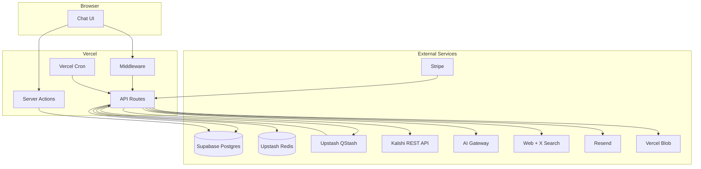
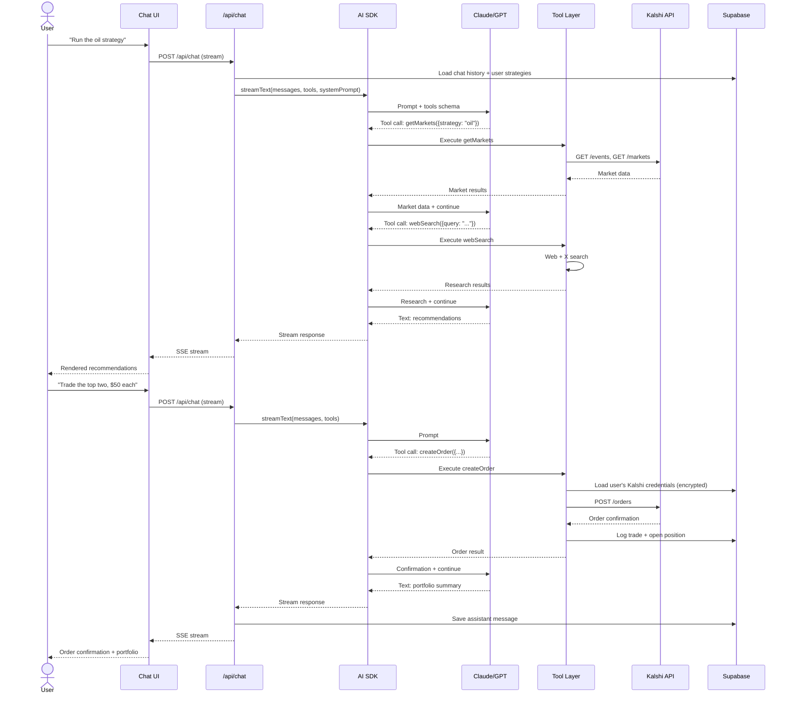
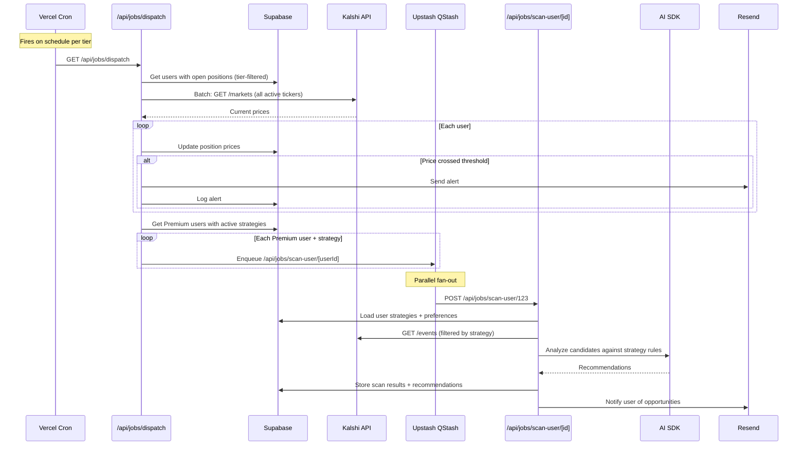
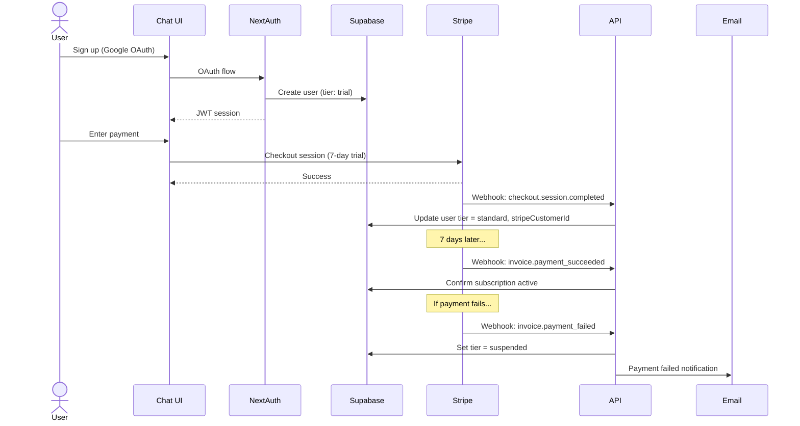
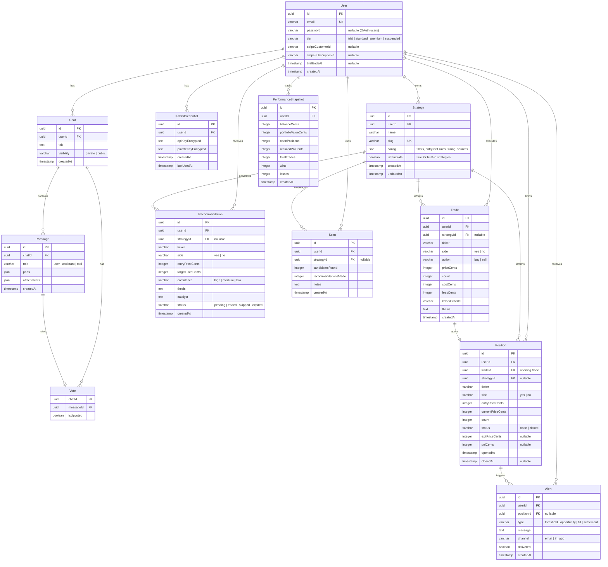
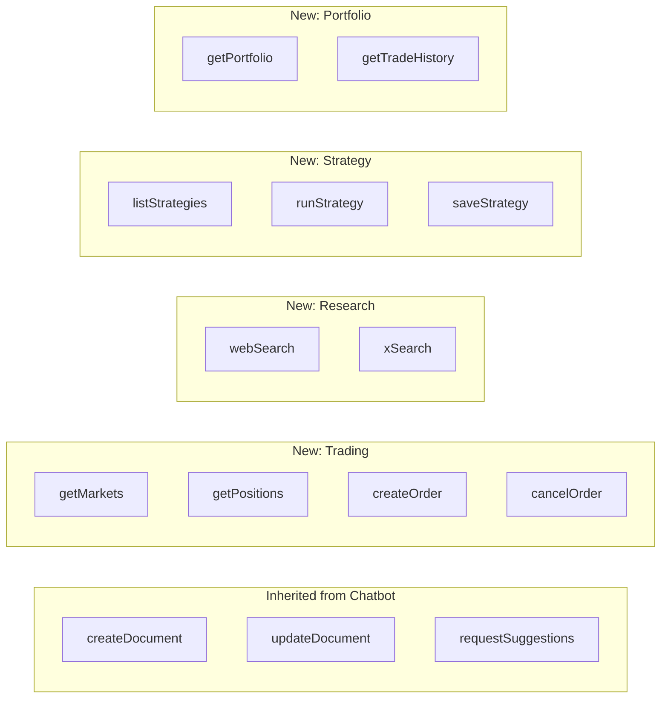
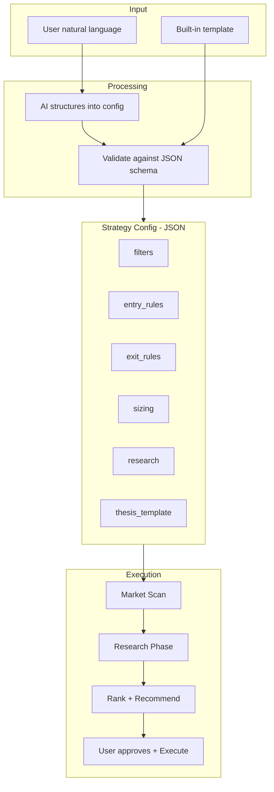

# Architecture

> High-level architecture for the Kalshi Trading Agent SaaS.
> See [VISION.md](VISION.md) for product scope and pricing.

---

## Tech Stack

| Layer | Choice | Why |
|-------|--------|-----|
| Framework | Next.js 16 (App Router) | Inherited from Vercel chatbot fork |
| Hosting | Vercel Pro | Native Next.js support, cron, serverless |
| Database | Supabase Postgres | Managed Postgres, swaps Neon from chatbot |
| ORM | Drizzle | Already in chatbot, type-safe, migrations |
| Cache / Streams | Upstash Redis | Serverless Redis, stream resumability |
| Job Queue | Upstash QStash | HTTP-based fan-out for per-user cron jobs |
| File Storage | Vercel Blob | Already integrated in chatbot |
| Auth | NextAuth v5 | Already in chatbot, add OAuth providers |
| AI | Vercel AI SDK v6 | Multi-provider streaming, tool calling |
| Billing | Stripe | Subscriptions, trials, webhooks |
| Email | Resend | Transactional alerts, Vercel-native |
| UI | shadcn/ui + Tailwind | Already in chatbot |

---

## System Overview



---

## Request Flows

### Chat + Trade Execution



### Scheduled Position Checks (Cron + QStash)



### Auth + Billing



---

## Database Schema



### Inherited Tables (from Vercel Chatbot)

The chatbot ships with `User`, `Chat`, `Message` (as `Message_v2`), `Vote` (as `Vote_v2`), `Document`, `Suggestion`, and `Stream` tables. We keep all of them and extend `User` with billing/tier fields. The trading tables above are additive.

---

## AI Tools

The AI agent has access to tools via the Vercel AI SDK `tools` parameter. Each tool is a Zod-validated function executed server-side.



### Tool Execution Security

- Trading tools (`createOrder`, `cancelOrder`) require user confirmation before execution — the LLM proposes, the user approves.
- Kalshi credentials are decrypted server-side per-request, never cached in memory.
- All tool calls are logged to the `Message` table with `role: "tool"`.

---

## Strategy Engine



---

## Cron Schedule

```mermaid
gantt
    title Daily Cron Schedule (ET)
    dateFormat HH:mm
    axisFormat %H:%M

    section Standard
    Position check 1     :09:00, 1m
    Position check 2     :11:00, 1m
    Position check 3     :13:00, 1m
    Position check 4     :15:00, 1m
    Position check 5     :17:00, 1m
    Daily snapshot        :22:00, 1m

    section Premium
    Hourly check + scan  :00:00, 1m
    Hourly check + scan  :01:00, 1m
    Hourly check + scan  :02:00, 1m
    Hourly check + scan  :03:00, 1m
    (continues hourly)   :04:00, 20h
    Daily snapshot        :22:00, 1m
```



### vercel.json cron config

```json
{
  "crons": [
    {
      "path": "/api/jobs/dispatch?tier=standard",
      "schedule": "0 9,11,13,15,17 * * 1-5"
    },
    {
      "path": "/api/jobs/dispatch?tier=premium",
      "schedule": "0 * * * *"
    },
    {
      "path": "/api/jobs/daily-snapshot",
      "schedule": "0 22 * * *"
    }
  ]
}
```

---

## Key Architecture Decisions

| Decision | Choice | Alternatives Considered |
|----------|--------|------------------------|
| Monolith vs microservices | Next.js monolith | Separate backend API — unnecessary complexity for V1 |
| Auth | Keep NextAuth, add OAuth | Supabase Auth — not needed since we use Drizzle ORM directly |
| Cron scalability | QStash fan-out for AI-heavy jobs | BullMQ worker — requires persistent process, not serverless-friendly |
| Kalshi integration | Direct REST API calls in tool layer | MCP server — adds npx dependency, patching issues in prod |
| Credential storage | Encrypted in Supabase, decrypt per-request | Vault/KMS — overkill for V1, can migrate later |
| Hosting | Vercel | AWS (ECS/Fargate) — weeks of setup, $200+/mo, migrate when needed |
