# Architecture

> High-level architecture for the SaaS trading platform.
> See [VISION.md](VISION.md) for product scope and pricing.

---

## Tech Stack

| Layer | Choice | Why |
|-------|--------|-----|
| Framework | Next.js 16 (App Router) | Inherited from Vercel chatbot fork |
| Hosting | Vercel Pro | Native Next.js support, cron, serverless |
| Database | Supabase Postgres | Managed Postgres, swaps Neon from chatbot |
| ORM | Drizzle | Already in chatbot, type-safe, migrations |
| Cache / Streams | Upstash Redis | Serverless Redis, stream resumability |
| Job Queue | Upstash QStash | HTTP-based fan-out for per-user cron jobs |
| File Storage | Vercel Blob | Already integrated in chatbot |
| Auth | NextAuth v5 | Already in chatbot, add OAuth providers |
| AI | Vercel AI SDK v6 | Multi-provider streaming, tool calling |
| Billing | Stripe | Subscriptions, trials, webhooks |
| Email | Resend | Transactional alerts, Vercel-native |
| UI | shadcn/ui + Tailwind | Already in chatbot |
| Finance Math | simple-statistics + trading-signals | Z-scores, Kelly, momentum indicators — see [Compute & Finance](#compute--finance) |

---

## System Overview

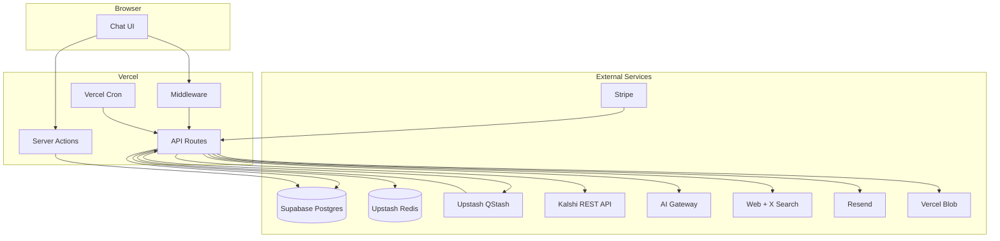

---

## Portfolio Model

The core domain model: Account → Strategy → Trade.

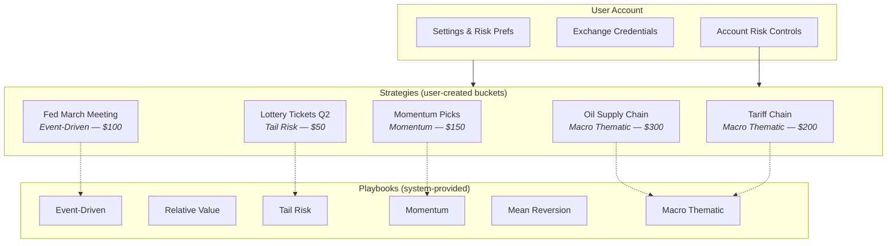

### Concepts

| Concept | Description | Lifecycle |
|---------|-------------|-----------|
| **Playbook** | System-provided playbook — how to scan, research, size, enter, exit. 6 types. | Immutable. Shipped with the product. |
| **Strategy** | User's application of a playbook to a specific idea. Has budget, config, trades. | User creates → AI populates → user manages → user archives |
| **Trade** | Individual position within a strategy. Linked to an exchange order. | AI recommends → user approves → filled → monitored → closed |

---

## Playbook System

Each playbook defines a pipeline that strategies inherit.

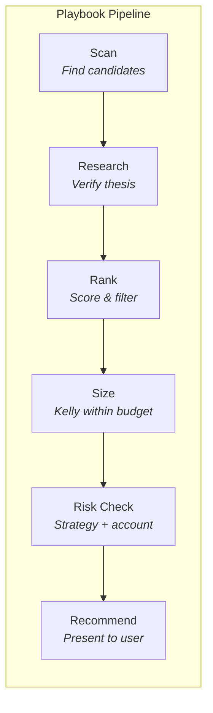

### Playbook Definitions

| Playbook | Scan Logic | Research Focus | Sizing Approach | Typical Timeline |
|-----------|-----------|---------------|-----------------|-----------------|
| **Event-Driven** | Markets with imminent catalysts (data releases, votes, decisions) | Catalyst outcome research, consensus vs. market | Edge-based Kelly | Hours to days |
| **Relative Value** | Related markets with mathematical inconsistencies | Settlement rule verification, probability distribution | Edge-based, per-leg | Days to weeks |
| **Tail Risk** | Contracts priced ≤3¢ with plausible catalysts | Base rate analysis, catalyst plausibility | Portfolio approach (basket of N positions) | Weeks to months |
| **Momentum** | Contracts with sustained price drift + volume increase | News correlation, trend confirmation | Trend-strength scaled | Days to weeks |
| **Mean Reversion** | Contracts with sharp recent moves (>15pts in <24h) | Catalyst verification/debunking | Reversion-magnitude scaled | Hours to days |
| **Macro Thematic** | Map causal chain → find markets at each link | Chain validation, second/third-order research | Per-link allocation within strategy budget | Weeks to months |

### Playbook Config Schema

Each strategy stores a config object structured by its playbook:

```
StrategyConfig {
  // Common to all playbooks
  filters: { keywords, event_types, min_volume, price_range }
  entry_rules: { max_entry_price, min_edge, min_time_to_expiry }
  exit_rules: { take_profit, stop_loss, time_stop, thesis_invalidation }
  sizing: { max_per_trade, kelly_fraction, budget_cap }
  research: { search_queries[], source_priority }
  thesis_template: { required_fields[] }

  // Playbook-specific extensions
  // Event-Driven: catalyst_date, catalyst_type, pre_vs_post_positioning
  // Relative Value: leg_definitions[], consistency_check_type
  // Tail Risk: max_entry_cents, min_days_to_expiry, target_portfolio_size
  // Momentum: drift_threshold, volume_increase_threshold, lookback_days
  // Mean Reversion: spike_threshold_points, spike_window_hours, fade_target
  // Macro Thematic: causal_chain[], per_link_allocation
}
```

### Multi-Instrument Architecture (V2 Ready)

Strategies carry an `instrument_type` field. V1 only implements `prediction_market`.

```
instrument_type: prediction_market | options | crypto

// V2: a single Macro Thematic strategy could hold:
//   - Kalshi oil contracts (prediction_market)
//   - WTI call options via Tradier (options)
//   - USO position via Coinbase (crypto)
// The playbook pipeline handles instrument-specific scan/research/execution.
```

---

## Risk Engine

Two-layer risk model: strategy-level and account-level.

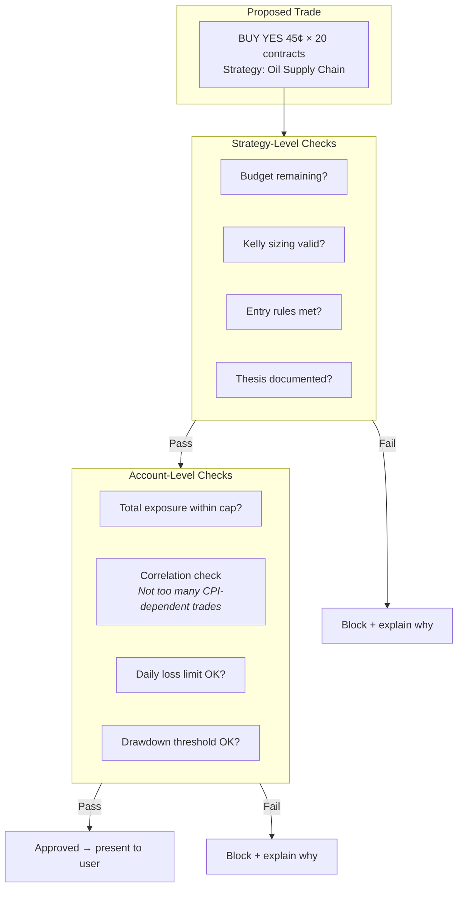

### Strategy-Level Controls

| Control | Implementation |
|---------|---------------|
| Budget cap | `strategy.budgetCents - sum(open positions cost) >= trade cost` |
| Kelly sizing | `position = min(0.5 × (edge / odds) × strategy_budget, max_per_trade)` |
| Entry rules | Validated against strategy config (max price, min edge, min time to expiry) |
| Exit rules | Stored per-trade, monitored by cron — take-profit, stop-loss, time-stop |
| Thesis requirement | Trade rejected if `thesis` field is empty |

### Account-Level Controls

| Control | Implementation |
|---------|---------------|
| Total exposure cap | `sum(all open position costs) / allocated_capital <= max_exposure_pct` |
| Correlation check | Count trades sharing the same underlying event/metric; warn if > N |
| Daily loss limit | `sum(realized losses today) <= daily_loss_limit_cents` |
| Drawdown pause | `(peak_portfolio_value - current_value) / peak >= drawdown_pct → block new trades` |
| Concentration limit | Max N trades on the same underlying event across all strategies |

---

## Request Flows

### Chat + Trade Execution

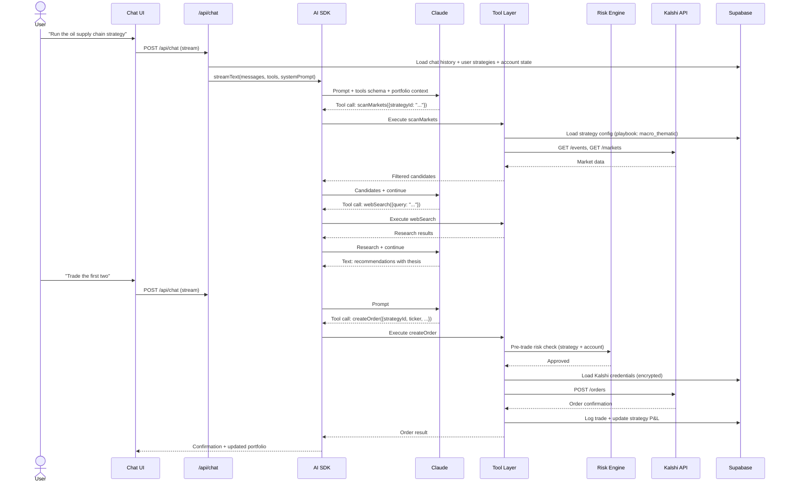

### Strategy Creation

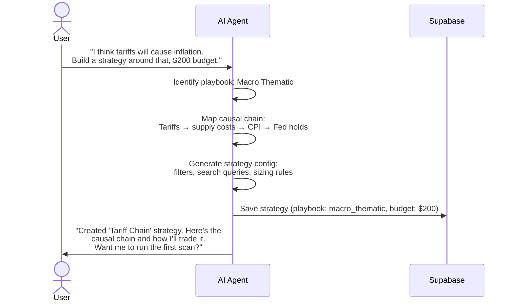

### Scheduled Position Checks (Cron + QStash)

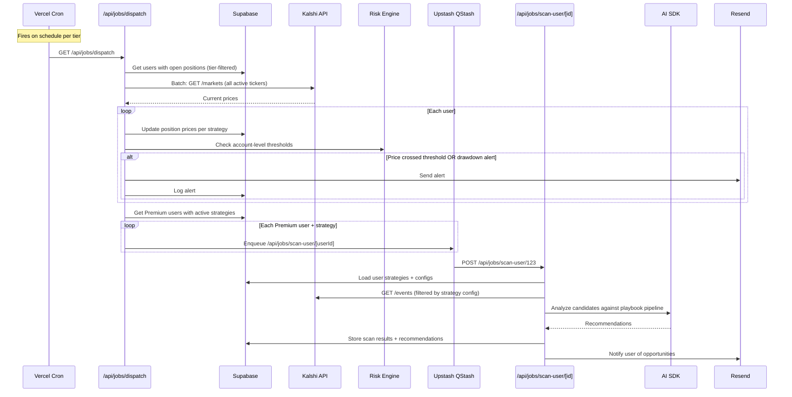

### Auth + Billing

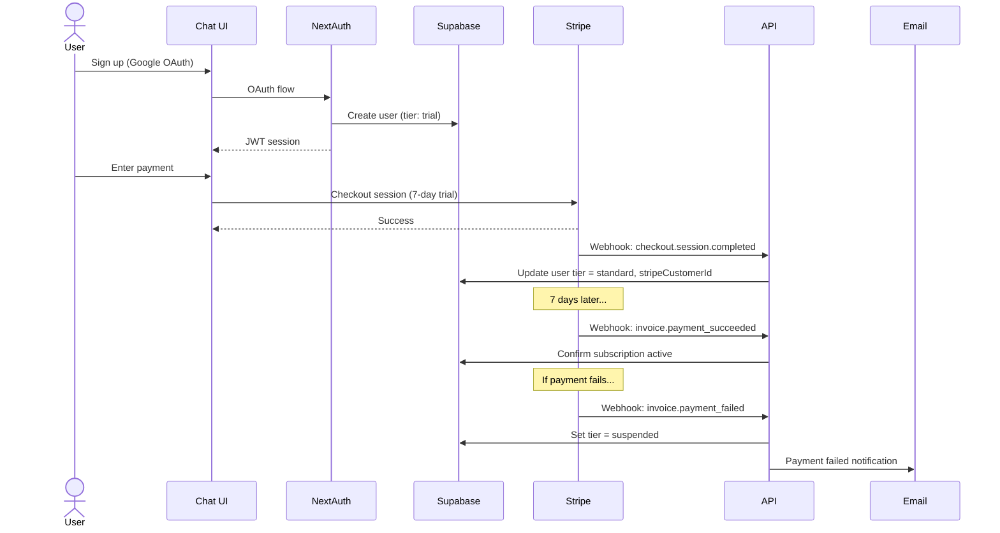

---

## Database Schema

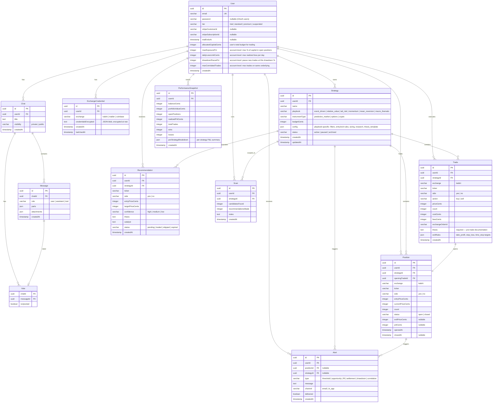

### Schema Changes from Previous Version

| Change | Reason |
|--------|--------|
| `Theme` → `Strategy` | Strategies are user-created instances; playbooks are system-provided (not in DB) |
| Added `playbook` + `instrumentType` to Strategy | Supports 6 playbooks, multi-instrument V2 readiness |
| Added `budgetCents` + `status` to Strategy | Strategy-level risk controls and lifecycle |
| `KalshiCredential` → `ExchangeCredential` | Multi-exchange V2 readiness |
| Added `strategyId` to Trade, Position, Recommendation, Scan, Alert | Everything rolls up to a strategy |
| Added `exitRules` + `thesis` to Trade | Per-trade risk controls and mandatory thesis |
| Added account-level risk fields to User | Drawdown, daily loss, exposure, correlation limits |
| Added `perStrategyBreakdown` to PerformanceSnapshot | Per-strategy performance attribution |
| Added `drawdown` + `correlation` alert types | Account-level risk alerts |

### Inherited Tables (from Vercel Chatbot)

The chatbot ships with `User`, `Chat`, `Message` (as `Message_v2`), `Vote` (as `Vote_v2`), `Document`, `Suggestion`, and `Stream` tables. We keep all of them and extend `User` with billing/tier/risk fields. The trading tables above are additive.

---

## AI Tools

The AI agent has access to tools via the Vercel AI SDK `tools` parameter.

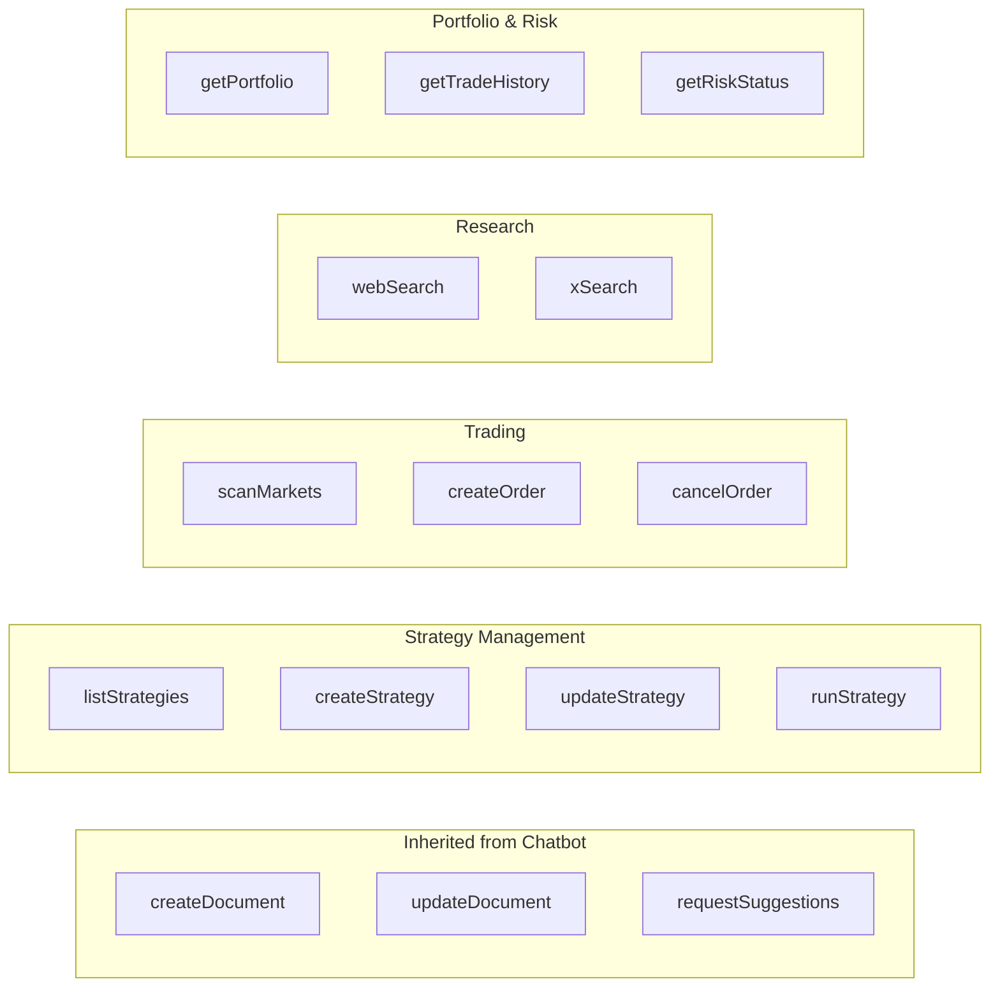

### Tool Descriptions

| Tool | Purpose | Confirmation Required |
|------|---------|----------------------|
| `listStrategies` | List user's strategies with status, budget, P&L | No |
| `createStrategy` | Create a new strategy (AI structures user intent into config) | No |
| `updateStrategy` | Modify strategy config, budget, or status | No |
| `runStrategy` | Execute a strategy's playbook pipeline (scan → research → recommend) | No |
| `scanMarkets` | Query exchange markets with filters from strategy config | No |
| `createOrder` | Place a limit order (passes through risk engine first) | **Yes** |
| `cancelOrder` | Cancel a resting order | **Yes** |
| `webSearch` | Web search for catalyst research | No |
| `xSearch` | X/Twitter search for real-time sentiment | No |
| `getPortfolio` | Account overview: per-strategy and total P&L, positions, cash | No |
| `getTradeHistory` | Past trades with outcomes, filterable by strategy | No |
| `getRiskStatus` | Account risk dashboard: exposure, correlation, drawdown | No |

### Tool Execution Security

- Trading tools (`createOrder`, `cancelOrder`) require user confirmation before execution — the LLM proposes, the user approves.
- All trades pass through the risk engine before reaching the exchange.
- Exchange credentials are decrypted server-side per-request, never cached in memory.
- All tool calls are logged to the `Message` table with `role: "tool"`.

---

## Cron Schedule

```mermaid
gantt
    title Daily Cron Schedule (ET)
    dateFormat HH:mm
    axisFormat %H:%M

    section Standard
    Position check 1     :09:00, 1m
    Position check 2     :11:00, 1m
    Position check 3     :13:00, 1m
    Position check 4     :15:00, 1m
    Position check 5     :17:00, 1m
    Daily snapshot        :22:00, 1m

    section Premium
    Hourly check + scan  :00:00, 1m
    Hourly check + scan  :01:00, 1m
    Hourly check + scan  :02:00, 1m
    Hourly check + scan  :03:00, 1m
    (continues hourly)   :04:00, 20h
    Daily snapshot        :22:00, 1m
```

### vercel.json cron config

```json
{
  "crons": [
    {
      "path": "/api/jobs/dispatch?tier=standard",
      "schedule": "0 9,11,13,15,17 * * 1-5"
    },
    {
      "path": "/api/jobs/dispatch?tier=premium",
      "schedule": "0 * * * *"
    },
    {
      "path": "/api/jobs/daily-snapshot",
      "schedule": "0 22 * * *"
    }
  ]
}
```

---

## Compute & Finance

### V1: TypeScript Inline (Prediction Markets)

Binary contracts pay $1 or $0. Position sizing, drawdown, and risk checks are straightforward formulas — no need for QuantLib or scipy.

**Dependencies:**

| Package | Purpose |
|---------|---------|
| `simple-statistics` | Z-scores, standard deviation, linear regression, quantiles, normal CDF |
| `trading-signals` | SMA, EMA, RSI, MACD, Bollinger Bands (momentum/mean-reversion playbooks) |

All finance logic lives behind clean interfaces in `lib/finance/`:

```
lib/finance/
  sizing.ts       — Kelly criterion, position sizing
  risk.ts         — drawdown, exposure, correlation, daily loss
  indicators.ts   — momentum detection, mean reversion signals
  portfolio.ts    — P&L calculation, Sharpe ratio, returns
  types.ts        — shared types
```

Each module exports pure functions with no awareness of where the math happens:

```
// lib/finance/sizing.ts
calculatePositionSize(edge, odds, budget, config) → { contracts, costCents }

// lib/finance/risk.ts
calculateDrawdown(equityCurve) → { maxDrawdown, currentDrawdown }
checkExposure(positions, allocatedCapital) → { withinLimits, currentPct }
checkCorrelation(positions, strategies) → { correlated[], warning }

// lib/finance/indicators.ts
detectMomentum(priceHistory, config) → { signal, strength, direction }
detectMeanReversion(priceHistory, config) → { signal, zScore, fadeTarget }
```

### V2: Python Quant Service

When V2 instruments require real quant math (Black-Scholes, greeks, portfolio optimization, correlation matrices across 50+ positions), the `lib/finance/` interfaces stay the same — implementations swap to HTTP calls to a Python service.

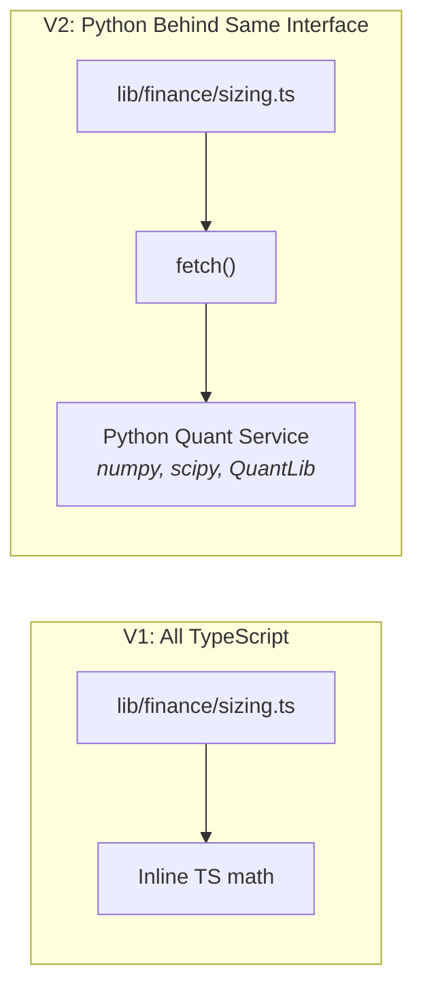

Two integration patterns depending on context:

**Synchronous (user is chatting, needs answer now):**

```
Next.js API route → AI tool call → lib/finance → fetch(Python service) → result
```

Vercel Pro functions can wait up to 800s. Quant calculations return in seconds. No architecture change — just a different function body inside `lib/finance/`.

**Async (scheduled scans, background analysis):**

```
Vercel Cron → QStash → Python worker → QStash callback → Next.js route → Supabase
```

QStash natively supports callbacks: publish with a `callback` URL, and QStash POSTs the worker's response back to your endpoint. No polling, no long-lived connections.

### V2: Infrastructure Options

V1 runs entirely on Vercel. V2 has two paths — decision deferred until V1 traction:

| Path | Stack | Trade-off |
|------|-------|-----------|
| **Vercel + Python sidecar** | Keep Vercel (Next.js) + add Railway or Fly.io (Python) + QStash bridge | Minimal infra change, fast to add, slightly more latency on sync calls |
| **AWS + Terraform** | ECS/Fargate (Next.js + Python) + SQS + RDS Postgres + ElastiCache Redis | Full control, terraform-managed, proven at scale, higher setup cost |

The `lib/finance/` interface boundary ensures either path works without application code changes. The choice is an infrastructure decision, not an application architecture decision.

---

## Key Architecture Decisions

| Decision | Choice | Alternatives Considered |
|----------|--------|------------------------|
| Portfolio model | Account → Strategy → Trade hierarchy | Flat strategy → trade (no grouping — loses the "bucket" mental model) |
| Playbooks | System-provided immutable playbooks, 6 types | User-defined everything (too complex for retail) |
| Risk engine | Two-layer: strategy + account level | Single-layer per-trade only (misses portfolio-level risks) |
| Monolith vs microservices | Next.js monolith | Separate backend API — unnecessary complexity for V1 |
| Auth | Keep NextAuth, add OAuth | Supabase Auth — not needed since we use Drizzle ORM directly |
| Cron scalability | QStash fan-out for AI-heavy jobs | BullMQ worker — requires persistent process, not serverless-friendly |
| Exchange integration | Direct REST API in tool layer | MCP server — adds npx dependency, patching issues in prod |
| Multi-instrument readiness | `instrumentType` enum on Strategy, `exchange` field on Trade/Position | Build only for Kalshi — would require schema migration for V2 |
| Credential storage | Encrypted in Supabase, decrypt per-request | Vault/KMS — overkill for V1, can migrate later |
| Finance compute | V1: TS inline behind `lib/finance/` interfaces. V2: swap to Python service. | All Python from day 1 (premature complexity), all TS forever (limits V2 instruments) |
| Hosting | V1: Vercel. V2: evaluate Vercel + Python sidecar vs AWS + Terraform | AWS from day 1 — weeks of setup before shipping product |
